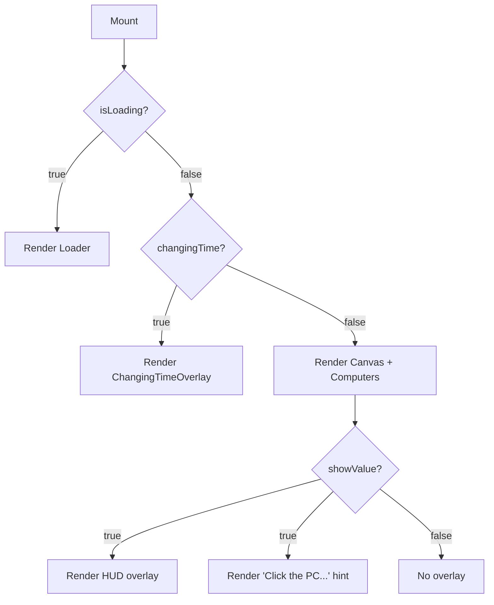

The `Home` component is the root of the portfolio experience. It wires together the `Loader` splash screen, the `@react-three/fiber` `Canvas`, the `Computers` 3D model, and the 2D HUD overlay into a single full-screen section.

## Overview

<CardGroup cols={3}>
  <Card title="3D canvas" icon="cube">
    Renders the bedroom scene via `@react-three/fiber`. Hidden while `isLoading` is true and replaced by `ChangingTimeOverlay` during time transitions.
  </Card>
  <Card title="Loader" icon="loader">
    Shown for the first 4 seconds while the GLTF model and assets initialise. See the [Loader](/components/loader) page for details.
  </Card>
  <Card title="HUD overlay" icon="layout-dashboard">
    Name badge, live clock, time-of-day selector, job title, and social links. Scales responsively and hides when the user zooms into the monitor.
  </Card>
</CardGroup>

## Camera hook

`MyCameraReactsToStateChanges` is a React Three Fiber hook registered with `useFrame`. On every rendered frame it forces the camera to a fixed position and orientation so the scene always opens from the same vantage point.

```jsx camera-hook.jsx
function MyCameraReactsToStateChanges() {
  useFrame((state) => {
    state.camera.position.set(0, 1, 0);
    state.camera.rotation.set(0, 0, 0);
  });
}
```

<Note>
  The camera is locked to `position(0, 1, 0)` and zero rotation every frame. `PresentationControls` inside `Computers` handles the orbit feel; this hook prevents the camera itself from drifting.
</Note>

## Time-of-day mapping

The `getPeriodOfDay` helper maps the current hour to an environment preset name consumed by `@react-three/drei`'s `<Environment>` component.

```jsx period-of-day.jsx
const getPeriodOfDay = (hours) => {
  if (hours >= 5  && hours < 7)  return 'sunset';    // Dawn
  if (hours >= 7  && hours < 12) return 'park';      // Morning
  if (hours >= 12 && hours < 17) return 'warehouse'; // Afternoon/Evening
  if (hours >= 17 && hours < 19) return 'dawn';      // Dusk
  return 'night';                                     // Night
};
```

| Return value | Label in UI | Hours |
|---|---|---|
| `sunset` | Dawn | 05:00 – 06:59 |
| `park` | Morning | 07:00 – 11:59 |
| `warehouse` | Evening | 12:00 – 16:59 |
| `dawn` | Dusk | 17:00 – 18:59 |
| `night` | Nightsly | 19:00 – 04:59 |

## State variables

<ParamField path="state.isLoading" type="boolean" default="true">
  Set to `true` on mount. A 4-second `setTimeout` flips it to `false`, replacing the `<Loader>` with the Canvas.
</ParamField>

<ParamField path="state.showValue" type="boolean" default="true">
  Controls visibility of the entire 2D HUD overlay. The `Computers` component calls `showDetails(false)` via the `showFunction` setter when the user clicks on the desk and the camera zooms in.
</ParamField>

<ParamField path="state.currentTime" type="Date">
  Updated every second via `setInterval`. Used to render the live clock in the HUD.
</ParamField>

<ParamField path="state.periodOfDay" type="string" default="getPeriodOfDay(currentHour)">
  One of `'sunset'`, `'park'`, `'warehouse'`, `'dawn'`, `'night'`. Initialised from the visitor's local clock and can be overridden via the dropdown. Passed directly to `<Computers periodOfDay={periodOfDay} />`.
</ParamField>

<ParamField path="state.changingTime" type="boolean" default="false">
  Flipped to `true` when the user changes the time-of-day dropdown. Stays `true` for 2 000 ms, during which `<ChangingTimeOverlay>` is rendered instead of the Canvas. Automatically resets via a `setTimeout` cleanup.
</ParamField>

## Render flow



## 2D HUD overlay

The overlay is mounted as an absolutely-positioned `div` in the bottom-right corner of the viewport. It is only visible when both `!isLoading` and `showValue` are true.

### Scaling

The overlay scales with `transform: scale(...)` anchored to the bottom-right corner. The scale factor depends on orientation:

```jsx scaling.jsx
const scale = window.innerWidth > window.innerHeight
  ? Math.max(0.6, window.innerWidth / 1920)  // landscape: min 0.6×, grow with width
  : window.innerHeight / 1080;               // portrait: scale to screen height
```

<Tip>
  The `Math.max(0.6, ...)` floor prevents the overlay from becoming unreadably small on narrow landscape viewports such as older laptops.
</Tip>

### Contents

<Steps>
  <Step title="Name badge">
    A black panel displaying `Namith Nimlaka` in the custom `retro` font at `text-3xl`.
  </Step>
  <Step title="Live clock">
    Renders `currentTime` as a 12-hour `hh:mm:ss` string split across two `<span>` elements so the time and AM/PM indicator align consistently.
  </Step>
  <Step title="Time-of-day dropdown">
    A `<select>` bound to `periodOfDay`. Changing the value calls `handlePeriodOfDayChange`, which sets `changingTime = true` for 2 seconds before the new environment preset renders.
  </Step>
  <Step title="Job title and social links">
    Displays `Software Engineer` alongside GitHub and LinkedIn icon links. Icons are served from `src/assets/icons/`.
  </Step>
</Steps>

### Pulsing hint text

A `"Click the PC..."` label is rendered in the top-left corner. Its color switches based on the active environment:

```jsx hint-color.jsx
color: periodOfDay === 'night' ? 'white' : 'black'
```

<Note>
  This ensures the hint remains legible against both dark (night) and light (daytime) environment backgrounds.
</Note>

## Effects summary

<AccordionGroup>
  <Accordion title="Loading timer (4 000 ms)">
    ```jsx
    useEffect(() => {
      const loadingTimer = setTimeout(() => setIsLoading(false), 4000);
      return () => clearTimeout(loadingTimer);
    }, []);
    ```
    Fires once on mount. Cleans up if the component unmounts before the timer fires.
  </Accordion>

  <Accordion title="Clock interval (1 000 ms)">
    ```jsx
    useEffect(() => {
      const timer = setInterval(() => setCurrentTime(new Date()), 1000);
      return () => clearInterval(timer);
    }, []);
    ```
    Keeps `currentTime` in sync with wall-clock time for the live HUD clock display.
  </Accordion>

  <Accordion title="ChangingTime reset (2 000 ms)">
    ```jsx
    useEffect(() => {
      if (changingTime) {
        const id = setTimeout(() => setChangingTime(false), 2000);
        return () => clearTimeout(id);
      }
    }, [changingTime]);
    ```
    Resets the overlay flag 2 seconds after the user picks a new time-of-day, giving the environment preset time to load.
  </Accordion>
</AccordionGroup>
