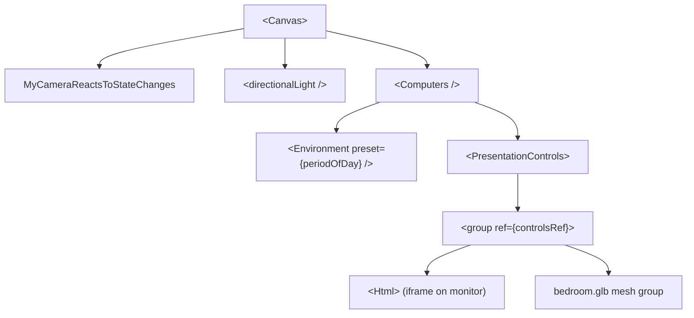

## Scene architecture

The entire 3D experience is built on [React Three Fiber](https://docs.pmnd.rs/react-three-fiber), a React renderer for Three.js. The component tree from root to model looks like this:



`Home.jsx` owns the `<Canvas>` and passes `periodOfDay` and `showDetails` down to `Computer.jsx`, which contains the actual geometry and controls.

## Loading the GLTF model

The bedroom scene is a single `.glb` file loaded with the `useGLTF` hook from `@react-three/drei`:

```jsx src/models/Computer.jsx
import { useGLTF } from '@react-three/drei';
import computerScene from '../assets/3d/bedroom.glb';

export default function Computer({ showDetails, periodOfDay }) {
  const { nodes, materials } = useGLTF(computerScene);
  // ...
}
```

`useGLTF` caches the parsed GLTF internally, so the model is only fetched and decoded once regardless of re-renders. The destructured `nodes` and `materials` objects give direct access to every named mesh and material defined in the `.glb` file.

<Note>
  The asset path is resolved at build time by Vite, which hashes and copies `bedroom.glb` into the output bundle. Always import static 3D assets rather than referencing them by raw path strings.
</Note>

## Camera setup

The camera is controlled by a custom hook placed directly inside the `<Canvas>`. React Three Fiber runs this hook on every frame via `useFrame`:

```jsx src/pages/Home.jsx
import { useFrame } from '@react-three/fiber';

function MyCameraReactsToStateChanges() {
  useFrame((state) => {
    state.camera.position.set(0, 1, 0);
    state.camera.rotation.set(0, 0, 0);
  });
}
```

This locks the default camera to position `(0, 1, 0)` with no rotation, establishing the resting viewpoint above and in front of the bedroom. Smooth camera transitions on click are handled separately by GSAP animations on the `PresentationControls` group — see [Interactions](/concepts/interactions).

## PresentationControls

`PresentationControls` from `@react-three/drei` wraps the entire model group and provides drag-to-rotate behavior:

```jsx src/models/Computer.jsx
<PresentationControls
  polar={[-Math.PI / 8, Math.PI / 8]}
  snap={true}
  cursor={true}
  rotation={matrixRotation}
  enabled={isRotatable}
>
  <group ref={controlsRef}>
    {/* model contents */}
  </group>
</PresentationControls>
```

<AccordionGroup>
  <Accordion title="polar">
    Clamps vertical drag to ±22.5° (`Math.PI / 8`). This prevents the user from flipping the scene upside down while still allowing a meaningful tilt.
  </Accordion>
  <Accordion title="snap">
    When `true`, the model snaps back to its resting rotation when the user releases the drag. This keeps the scene consistently oriented after interaction.
  </Accordion>
  <Accordion title="cursor">
    When `true`, the CSS cursor changes to a grab cursor over the scene, providing a visual affordance that the scene is draggable.
  </Accordion>
  <Accordion title="enabled">
    Toggled to `false` after the user clicks into a focused view (e.g., zooming in on the monitor). Drag is re-enabled when Escape is pressed.
  </Accordion>
  <Accordion title="rotation">
    Controlled by `matrixRotation` state. Reset to `[0, 0, 0]` on Escape to return the model to its default orientation.
  </Accordion>
</AccordionGroup>

## Embedding the iframe on the monitor

The portfolio website is displayed on the monitor mesh using the `<Html>` component from `@react-three/drei`. This component projects a DOM element into 3D space:

```jsx src/models/Computer.jsx
<Html
  wrapperClass='monitor'
  position={[-1.93, 1.245, -0.479]}
  transform
  rotation={[1.6, 1.67, -1.6]}
  distanceFactor={0.236}
>
  <iframe
    seamless
    frameBorder={0}
    loading='lazy'
    src="https://namith.vercel.app/"
  />
</Html>
```

The key props:

| Prop | Value | Purpose |
|------|-------|---------|
| `position` | `[-1.93, 1.245, -0.479]` | Aligns the DOM element with the monitor screen surface in world space |
| `transform` | — | Applies a CSS 3D transform so the element perspectively matches the scene camera |
| `rotation` | `[1.6, 1.67, -1.6]` | Rotates the HTML plane to match the physical tilt of the monitor mesh |
| `distanceFactor` | `0.236` | Scales the HTML element relative to camera distance, keeping it the right size |

<Warning>
  The iframe loads a remote URL. If you replace the `src` with a URL that sends `X-Frame-Options: DENY` or `SAMEORIGIN` headers, the browser will block the embed.
</Warning>

## Environment lighting

The `<Environment>` component sets the scene's image-based lighting (IBL) using one of Drei's built-in HDRI presets:

```jsx src/models/Computer.jsx
<Environment preset={periodOfDay} />
```

The `periodOfDay` prop is derived from the current system time and passed down from `Home.jsx`. See [Time of day lighting](/concepts/time-of-day) for the full mapping of hours to preset names.
